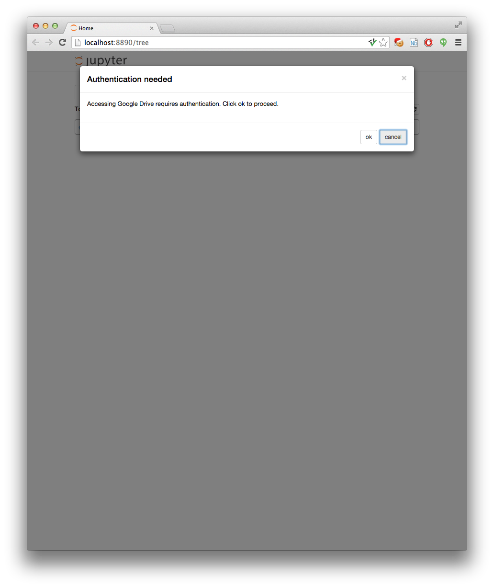
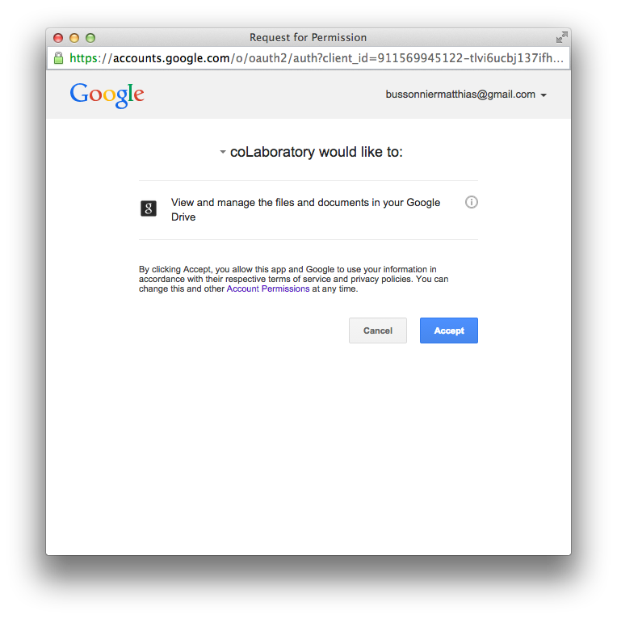

# Google Drive support for Jupyter Notebook


This repository contains custom
[`Contents`](https://github.com/ipython/ipython/blob/master/IPython/html/static/services/contents.js) classes that allows IPython to use
Google Drive for file management.  The code is organized as a python package
that contains functions to install a Jupyter Notebook JavaScript extension,
and activate/deactivate different IPython profiles to be used with Google drive.

To install this package, run

```bash
git clone git://github.com/jupyter/jupyter-drive.git
pip install -e jupyter-drive
```

This will install the package in development mode with pip, which means that any
change you make to the repository will be reflected into the importable version
immediately.

To install the notebook extension and activate your configuration with Google
Drive, run

```bash
python -m jupyterdrive
```

To deactivate, run

```bash
python -m jupyterdrive --deactivate
```

## Note on Jupyter/IPython

We try to support both IPython 3.x and above version, though many changes in configuration 
between IPython 3.x and later versions may cause the exact configuration path to vary from system to system.

## Symlink files

By default all the Javascript files will be symlinked, so any update to the package python
or javascript will be reflected on your python server.
Use the  `--no-symlink` option to actually copy the file on their final destination.

## Mixed contents

You can also install the `MixedContentsManager`, to do so install as before with
the `--mixed` options. For example, on the default profile:

```bash
python -m jupyterdrive --mixed
```

The mixed content manager will show contents from both the local hard drive and the remote
google drive as two directories in your dashboard.

#### mixed content configuration.

All of the following files should be created automatically
the first time that you run the content manager. You might need to modify these files manually to get the contents manager to work.

To modify the configuration of the mixed contents manager you need to update the following files:

Under Jupyter/IPython 4.x+ `<config-dir>/jupyter_notebook_config.json` which by default should have the following structure :


```json
{
  "nbformat": 1,
  "NotebookApp": {
    "contents_manager_class": "jupyterdrive.mixednbmanager.MixedContentsManager",
    "tornado_settings": {
      "contents_js_source": "nbextensions/gdrive/mixed-contents"
    }
  },
  "MixedContentsManager":{
    "filesystem_scheme": [
        {
          "root":"local",
          "contents":"IPython.html.services.contents.filemanager.FileContentsManager"
        },
        {
          "root": "gdrive",
          "contents": "jupyterdrive.clientsidenbmanager.ClientSideContentsManager"
        }
      ]
  }

}
```

Under IPython 3.x This file would be `<profile>/ipython_notebook_config.json`.

The `root` field of `filesystem_scheme` represents the name that would be used as the virtual mount points for the contents manager in the dashbord and should be consistent with the name given in `nbconfig/common.json` described below.

The `contents` field contains the fully qualified name of a Contents manager to
mount on the mountpoint.

The second config file that deals with configuring the frontend should be:

```json
  {
    "schema": [
      {
        "stripjs": false,
        "contents": "services/contents",
        "root": "local"
      },
      {
        "stripjs": true,
        "contents": "./drive-contents",
        "root": "gdrive"
      }
    ]
  }
```

To modify it, in a notebook access the config object, and extract default value: 
`>>> data = IPython.notebook.contents.config.data` . Change one of the values, 
for example : `>>> data.mixed_contents.schema[0].root = 'new_root'`. Update the config to the new value :
`>>> IPython.notebook.contents.config.update(data)`.


As stated previously the `root` value should match python side config file,
`contents` represents the client-side content manager that need to be used.
`stripjs` is a boolean value that indicates whether the name of the mount point
should be stripped from the various paths on the javascript side before passing
it to the different subcontent managers.


## Other options

If IPython has been installed system wide, in a virtual environment or with
some custom setup you might need to pass `--user`, `-prefix <prefix>` or
`--path <path>` option to install the extension in a user-owned profile
location.

See `python -m jupyterdrive --help` for more information.

## deactivate a profile

It is not yet possible to deactivate the drive integration automatically. But
you can get rid of `~/.ipython/profile_defaut/ipython_notebook_config.json`
config file to deactivate Google Drive as well as other config options.

The configuration of IPython/Jupyter is done through the `.json` file in the
profile and will take precedence on configuration done
in `.py` files, though you can still use non conflicting options.

# First launch

Launch IPython with the profile in which you activated jupyter-drive:

```bash
ipython notebook --profile <profilename>
```

On first launch, the application will ask you for the authorization to access
your files on Google Drive.  It only asks for permission to create new files or
to access files it has created or that you manually open with this application.
It also requires permission to access file/directory metadata, in order
to display the list of files/directories in the tree view.

The request pop-up looks like the following:



Clicking ok will open a Google OAuth pop-up.  You will see that the `Jupyter
Drive` application wants access to some information about your files. Keep that
in mind if you want to revoke access at a later point.



Once you click `Accept` you should be able to start creating new notebooks on
Google Drive, and open existing ones created by this application, and
view files/directories in the tree view.

## Advanced configuration

The contents manager can access the `common` section of nbconfig, thus
you can set config values in `<profile_dir>/nbconfig/common.json`. The default
values that are used are the following:

```json

{"gdrive":
    {
    "METADATA_SCOPE": true,
    "FILE_SCOPE": true,
    "CLIENT_ID": "763546234320-uvcktfp0udklafjqv00qjgivpjh0t33p.apps.googleusercontent.com"
    }
}
```

The `APP_ID` section is not yet configurable, but should be configurable in the
same way at some point in the future.

# Developing

The client-side code for jupyter-drive is written in TypeScript. The TypeScript
transpiler can be installed using ``npm``:

```console
npm install
```

The JavaScript may then be re-compiled using ``npm run``:

```console
npm run gulp js
```

